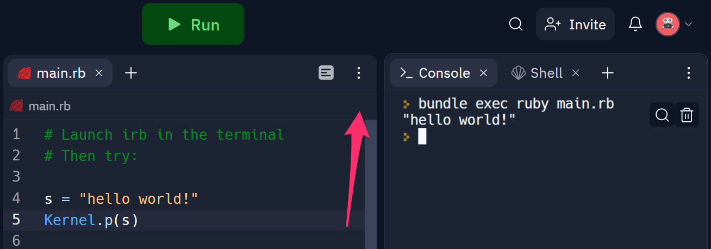
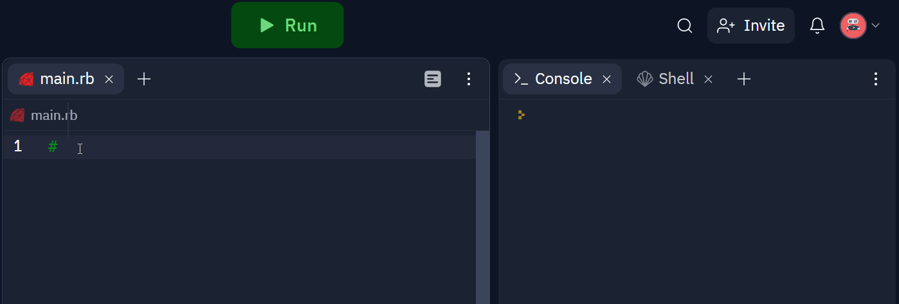

# Replace with lesson title

Add your content here!

## Heading 1

Use `##` second or greater level headings (HTML `<h2>` and greater).

### assets

Reference images from the `assets/` folder like so:

```



```

Which renders (except within Learn):


On pushes, the `assets/` be uploaded to ....


<!-- an AWS S3 Bucket. Then, when the Lesson is generated on Learn, their URLs will be replaced as:

```
https://learn-lesson-assets.s3.us-east-2.amazonaws.com/<name-of-lesson-repo>/example-image.png
```

## Test images uploaded to AWS


 -->
